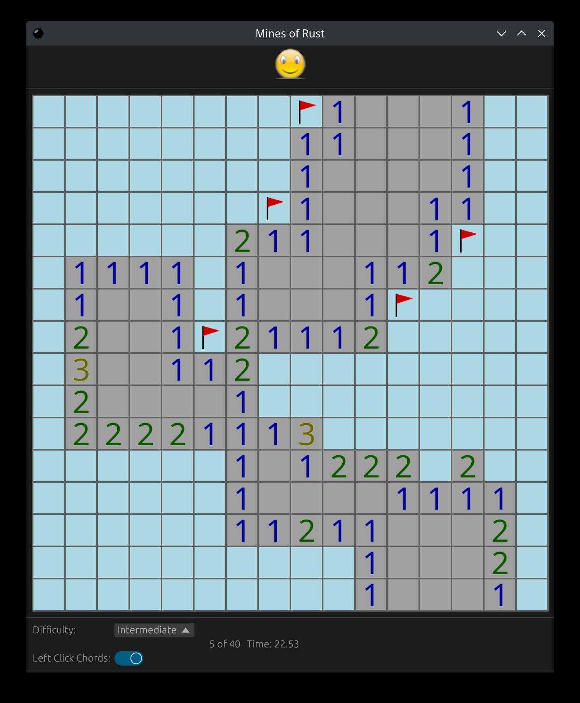

# Mines Of Rust

## Simple Rust Minesweeper implementation for when I'm bored

<p align="center">
  
</p>

As a whole, Mines of Rust (MoR) provides a simple game interface for the desktop and has been tested to work on Windows,
MacOS, and Linux. It is written in Rust and uses the [egui](https://github.com/emilk/egui/) immediate-mode GUI
framework. In addition, it also provides a minesweeper model for optional use in other applications.

This is being developed on a loose basis with no real plans or goals other than a quickly playable clone of Minesweeper.
I do have ideas for what I'd eventually like to add (leaderboards, etc), but those will be implemented more or less
whenever I get bored enough to do it.

## Hot Keys:

* *ctrl+n* - New Game
* *ctrl+r* - Reset game (same game board)
* *ctrl+q* - Exit

## Building from source

A working Rust (https://www.rust-lang.org/) installation is required for building. Mines of Rust targets the 2021
edition, stable branch.

MoR is build and tested on Linux (Fedora, Ubuntu, Kubuntu), MacOS, and Windows (natively and WSL2.0)

### Install via apt (Debian, Ubuntu, ...)

Download the pre-built deb file from the project page (if available).

```bash
sudo apt install ./minesofrust_0.1.0-1_amd64.deb
```

NOTE: Adjust the output debian package filename to what is output by the build.

### Install via rpm (RHEL, CentOS, Fedora, ...)

Download the pre-built rpm file from the project page (if available).

```bash
rpm -ivh minesofrust-0.1.0-1.x86_64.rpm
```

NOTE: Adjust the output rpm package filename to what is created by build.

### Building Install Packages using Docker

Install packages for MoR are currently built within Docker containers and are kicked off thusly:

```bash
# Fedora / Red Hat:
sh dockerbuild-fedora.sh

# Debian / Ubuntu:
sh dockerbuild-debian.sh
```

Build outputs will be placed into the `target` directory.

## Credit

Design and Development: Kevin M. Gill

Testing and Concept: Liam Gill